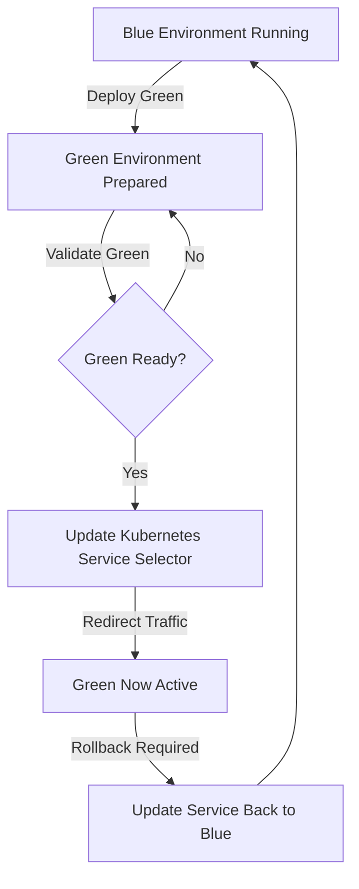

# Blue-Green Deployment Project

This project demonstrates a Blue-Green Deployment strategy using Docker, Docker Compose, Kubernetes, and Minikube.

The application consists of:
- Node.js Backend API
- MongoDB Database
- Blue Frontend - Basic UI
- Green Frontend - Enhanced UI
- Kubernetes Service for Blue-Green traffic switching

## Prerequisites

- Docker Desktop
- Minikube
- kubectl
- Helm
- Node.js
- Git

## Project Setup

### 1. Clone the Repository

```bash
git clone https://github.com/NitinSingh-ops/Blue-green-Deployment.git
cd Blue-green-Deployment
```

### 2. Local Development

#### Backend Setup

```bash
cd backend
npm install
```

Create `.env`:

```env
PORT=5000
MONGO_URI=mongodb://localhost:27017/bluegreen
```

Start backend:

```bash
npm start
```

Backend: `http://localhost:5000`

Health check: `http://localhost:5000/health`

#### Blue Frontend Setup

```bash
cd frontend-blue
npm install
```

Create `.env`:

```env
PORT=3100
```

Start:

```bash
npm start
```

Blue frontend: `http://localhost:3100`

Blue represents the **Basic UI** version.

#### Green Frontend Setup

```bash
cd frontend-green
npm install
```

Create `.env`:

```env
PORT=3200
```

Start:

```bash
npm start
```

Green frontend: `http://localhost:3200`

Green represents the **Enhanced UI** version.

## 3. Dockerization

For Minikube:

```powershell
minikube docker-env --shell powershell | Invoke-Expression
```

Build Backend:

```bash
docker build -t bluegreen/backend:v1 ./backend
```

Build Blue Frontend:

```bash
docker build -t bluegreen/frontend-blue:v1 ./frontend-blue
```

Build Green Frontend:

```bash
docker build -t bluegreen/frontend-green:v1 ./frontend-green
```

Verify:

```bash
docker images
```

## 4. Docker Compose

Start all services:

```bash
docker compose up -d --build
```

Verify:

```bash
docker compose ps
```

Stop:

```bash
docker compose down
```

## 5. Kubernetes Deployment

### Minikube Setup

```bash
minikube start --driver=docker
minikube status
```

Optional addons:

```bash
minikube addons enable metrics-server
minikube addons enable ingress
```

## 6. Kubernetes Manifest Files

The `k8s/` directory contains:

```text
k8s/
├── mongodb.yaml
├── backend.yaml
├── frontend-blue.yaml
├── frontend-green.yaml
└── frontend-service.yaml
```

Blue uses:

```yaml
app: frontend
version: blue
```

Blue listens on port `3100`.

Green uses:

```yaml
app: frontend
version: green
```

Green listens on port `3200`.

The frontend Service is a NodePort service. Its selector controls which frontend receives traffic.

## 7. Deploy to Minikube

```bash
kubectl apply -f k8s/mongodb.yaml
kubectl apply -f k8s/backend.yaml
kubectl apply -f k8s/frontend-blue.yaml
kubectl apply -f k8s/frontend-green.yaml
kubectl apply -f k8s/frontend-service.yaml
```

Verify:

```bash
kubectl get deployments
kubectl get services
kubectl get pods
```

Expected workloads:

```text
2 Backend Pods
2 Blue Frontend Pods
2 Green Frontend Pods
1 MongoDB Pod
```

## 8. Blue-Green Switching

### Initial Blue Deployment

The Service initially points to Blue:

```yaml
selector:
  app: frontend
  version: blue
```

Target port:

```yaml
targetPort: 3100
```

Verify:

```bash
kubectl get service frontend-service -o yaml
```

Access:

```bash
minikube service frontend-service --url
```

The application displays **Version: Basic UI**.

### Switch Blue to Green

Change the selector:

```powershell
@'
{
  "spec": {
    "selector": {
      "app": "frontend",
      "version": "green"
    }
  }
}
'@ | Set-Content -Path "$env:TEMP\green-patch.json"
```

Apply:

```powershell
kubectl patch service frontend-service --type=merge --patch-file "$env:TEMP\green-patch.json"
```

Change target port to `3200`:

```powershell
@'
{
  "spec": {
    "ports": [
      {
        "name": "http",
        "port": 80,
        "targetPort": 3200
      }
    ]
  }
}
'@ | Set-Content -Path "$env:TEMP\green-port-patch.json"
```

Apply:

```powershell
kubectl patch service frontend-service --type=merge --patch-file "$env:TEMP\green-port-patch.json"
```

Verify:

```powershell
kubectl get service frontend-service -o yaml
```

Expected:

```yaml
selector:
  app: frontend
  version: green
```

and:

```yaml
targetPort: 3200
```

Access:

```bash
minikube service frontend-service --url
```

The application should display **Version: Enhanced UI**.

### Rollback Green to Blue

Create the Blue selector patch:

```powershell
@'
{
  "spec": {
    "selector": {
      "app": "frontend",
      "version": "blue"
    }
  }
}
'@ | Set-Content -Path "$env:TEMP\blue-patch.json"
```

Apply:

```powershell
kubectl patch service frontend-service --type=merge --patch-file "$env:TEMP\blue-patch.json"
```

Change target port back to `3100`:

```powershell
@'
{
  "spec": {
    "ports": [
      {
        "name": "http",
        "port": 80,
        "targetPort": 3100
      }
    ]
  }
}
'@ | Set-Content -Path "$env:TEMP\blue-port-patch.json"
```

Apply:

```powershell
kubectl patch service frontend-service --type=merge --patch-file "$env:TEMP\blue-port-patch.json"
```

Verify:

```powershell
kubectl get service frontend-service -o yaml
```

Expected:

```yaml
selector:
  app: frontend
  version: blue
```

and:

```yaml
targetPort: 3100
```

The application should return to **Version: Basic UI**.

## 9. Verification

Check pods:

```bash
kubectl get pods -o wide
```

Check deployments:

```bash
kubectl get deployments
```

Check services:

```bash
kubectl get services
```

Check Service:

```bash
kubectl get service frontend-service -o yaml
```

Check endpoints:

```bash
kubectl get endpoints frontend-service
```

View logs:

```bash
kubectl logs <pod-name>
```

Describe Service:

```bash
kubectl describe service frontend-service
```

Backend health check:

```powershell
Invoke-RestMethod http://localhost:5000/health
```

## 10. Health Checks

The backend exposes:

```text
GET /health
```

Kubernetes deployments include readiness and liveness probes to verify application health.

## 11. User Registration

The application supports user registration. The Backend API stores registration data in MongoDB.

### Blue Version

The Blue frontend provides the Basic UI.

### Green Version

The Green frontend provides the Enhanced UI with additional fields such as:
- Interests
- Languages

Successful registration data can be verified in MongoDB.

## 12. Blue-Green Deployment Flow Chart



### Flow Explanation

1. Blue environment is the initial production version.
2. Green environment is deployed alongside Blue.
3. Green environment is validated.
4. Kubernetes Service selector is updated.
5. Production traffic is redirected to Green.
6. Blue remains available as the rollback environment.
7. If required, traffic is switched back to Blue.

## 13. Best Practices

- Implement health checks.
- Use readiness and liveness probes.
- Use resource requests and limits.
- Deploy multiple replicas for availability.
- Validate the new version before switching traffic.
- Keep the previous version available for rollback.
- Use Kubernetes labels to identify Blue and Green versions.
- Use versioned Docker images.
- Keep application configuration outside the Docker image.
- Do not commit `.env` files or sensitive credentials.
- Monitor application logs and Kubernetes workloads.

## 14. Troubleshooting

Check pod status:

```bash
kubectl get pods
```

View pod logs:

```bash
kubectl logs <pod-name>
```

Describe pod:

```bash
kubectl describe pod <pod-name>
```

Check Service:

```bash
kubectl get service frontend-service
```

Describe Service:

```bash
kubectl describe service frontend-service
```

Check endpoints:

```bash
kubectl get endpoints frontend-service
```

Check Minikube:

```bash
minikube status
```

Open application:

```bash
minikube service frontend-service --url
```

## 15. Cleanup

Remove Kubernetes resources:

```bash
kubectl delete -f k8s/
```

Stop Minikube:

```bash
minikube stop
```

Delete the Minikube cluster completely if required:

```bash
minikube delete
```

## 16. Screenshots

The `Screenshots/` directory contains implementation evidence including:

- Project setup
- Backend health check
- Blue frontend
- Green frontend
- User registration
- MongoDB data
- Docker images
- Kubernetes deployments
- Kubernetes pods
- Kubernetes Service
- Blue traffic verification
- Green traffic verification
- Blue-Green traffic switching
- Rollback verification
- Final Kubernetes status
- Git submission

## 17. GitHub Repository

Repository:

https://github.com/NitinSingh-ops/Blue-green-Deployment

The repository contains:

- Application source code
- Dockerfiles
- Docker Compose configuration
- Kubernetes manifests
- Deployment scripts
- Screenshots
- README documentation

## Conclusion

This project successfully demonstrates a complete **Blue-Green Deployment workflow using Docker and Kubernetes**.

Both Blue and Green frontend versions are deployed simultaneously. The Kubernetes Service controls which version receives production traffic.

The implementation was tested by:

1. Deploying Backend and MongoDB.
2. Deploying Blue and Green frontend versions.
3. Routing traffic to Blue.
4. Verifying the Basic UI.
5. Switching traffic from Blue to Green.
6. Verifying the Enhanced UI.
7. Rolling traffic back from Green to Blue.
8. Verifying the Basic UI after rollback.
9. Confirming Kubernetes pods and services are healthy.

The project demonstrates how Blue-Green Deployment provides safer releases, minimal downtime, and fast rollback capability.

## License

This project is licensed under the MIT License.
